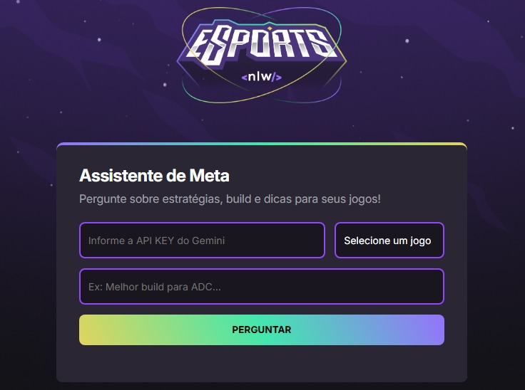

# 🎮 Assistente de Meta – NLW Agents

Projeto desenvolvido durante o evento **NLW Agents** da [Rocketseat](https://www.rocketseat.com.br/), com foco em aplicações web integradas com **IA generativa**.

---

## 🧠 Sobre o projeto

O **Assistente de Meta** é uma aplicação web full stack que utiliza **Inteligência Artificial** para responder dúvidas sobre jogos, como:

- Estratégias personalizadas
- Melhores builds
- Dicas táticas para personagens e posições

A IA foi integrada via **API do Gemini (Google)**, tornando o app uma ferramenta interativa voltada para gamers 🎮

---

## 🚀 Funcionalidades

- Integração com modelo LLM (Gemini) via API
- Campo para perguntas sobre jogos
- Escolha do jogo (ex: League of Legends, CS:GO)
- Interface moderna e responsiva
- Respostas em tempo real com base na IA generativa

---

## 🛠️ Tecnologias utilizadas

- **HTML**
- **CSS**
- **JavaScript (ES6+)**
- **Gemini API (Google AI)**
- **Prompt Engineering**
- **Design Responsivo (mobile-first)**

---

## 💡 Aprendizados

- Estruturação de páginas web com foco em usabilidade
- Conexão front-end com serviços de IA
- Escrita de prompts eficientes para LLMs
- Organização de código limpo e escalável
- Desenvolvimento full stack com propósito

---

